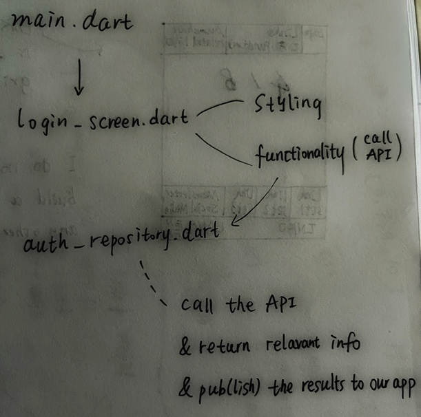
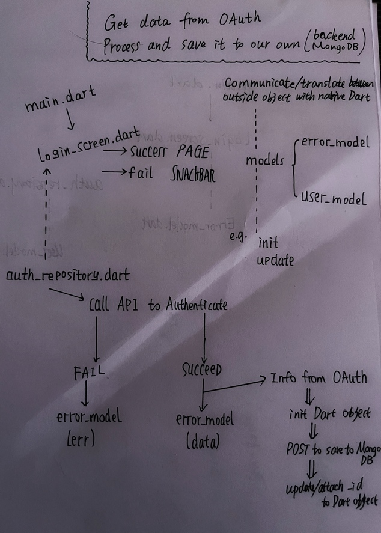

## Note

> I wrote all the other notes on my [blog](https://codingezio.github.io/one-to-infinity-flutter/)

## Overview

> Basically what this `README.md` is all about

### Authentication

#### OAuth 2.0 for Google

#### Authenticate then Save

